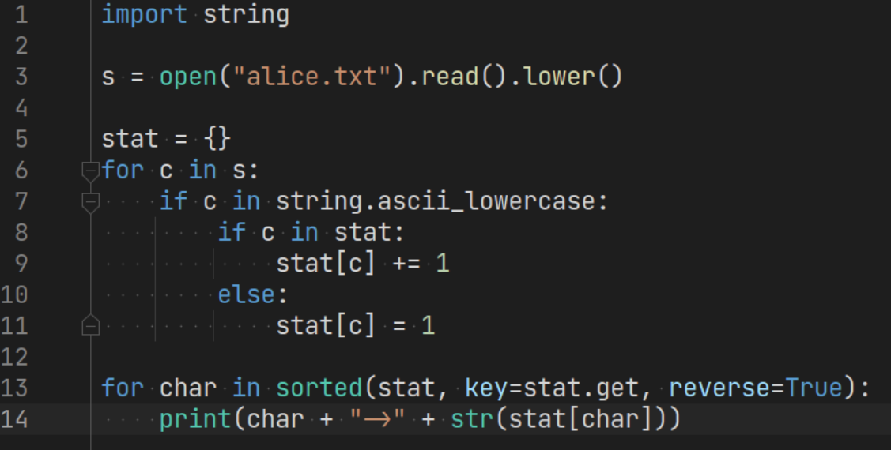
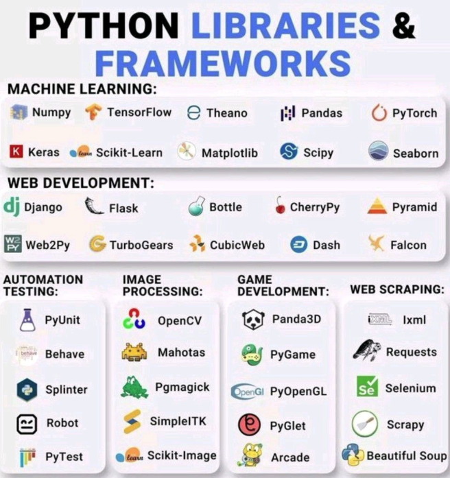
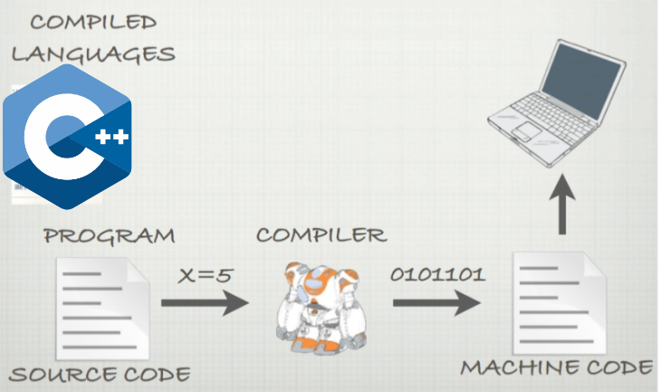
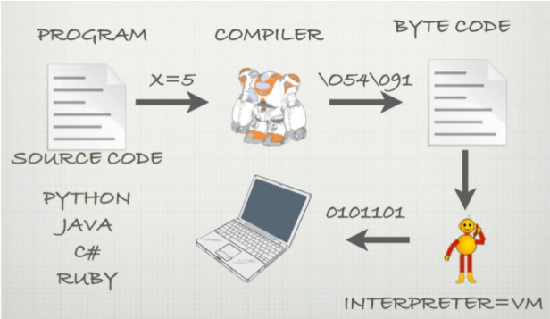
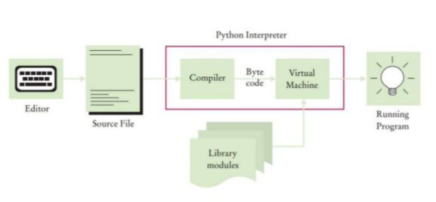

## Lesson1 - Introduction, first run [10-13]
- *__meta*
    -   The 1st lesson should be simple and short not to scare students
- Introduction to Python [5]
    -   When and by whom it was invented [2]
        -   1991 by Guido Van Rossum
            -  
            - Hobby project to have fun during long XMax holidays
        -   Came from academia -> easy to learn
        -   2.x vs 3.x
    -   Why so popular [1]
        - Concise
        - Minimalistic
        - Intuitive
        - Slow, but who cares :)
        - Look how readable it is:
          - 
    - Domains [1]
        -   DS, ML, AI
        -   Automation
        -   Web Backend
            - 
    -   Companies & products [1]
        -   Google, MS, Lyft
        -   WoT, Pinterest, YouTube, Dropbox, Reddit, Instagram
- What's in a language? [3][?]
    - Any language is a set of rules (syntax+grammar) of how to combine words (vocabluary) into sentences to convey some meaning.
    - Programming language is a set of rules of how to instruct a computer to do a certain things.
    - Another term is compiler. Compiler is a special program that translates text of another program into understandable instructions for computer (OS+CPU).
        - 
    - In case of Python there is a VM. VM takes special bytes codes and run them on CPU. This additional level of indirection allows to have cross-platform programs.
        - 
    - In Python compiler and VM are united in one executable file, which is called interpreter.
        - 
    - That's why we need to install language interpreter to work with Python. Let's do it!
- Install and run Python: 3.<latest> [2]
    -   Show how to download and install
    -   Windows: cmd -> python
    -   MacOS: terminal -> python
    -   python --version
- Let's configure development environment [3]
    -   Let's test basic commands with REPL [3]
        -   2+2
        -   5/6
        -   2**3
        -   Note how inconvenient it is to write code like this
            -   no history after restart
- H/w [0]
    -   1\. Install Python
    -   2\. Run any Python command