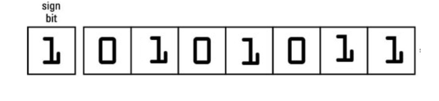
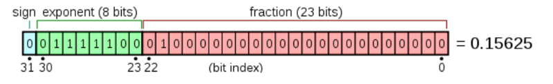

## Lesson4 - Numeric types, arithmetic operations  [13]
- Numeric types [3]
    -   int, float
    -   int
        - 0, 1, -5
        - 
    -   float
        -   1.1, -4.5, 1.
        - 
        -   floats can be tricky [?]
            -   1.0 - 0.9 != 0.1
            -   0.1 + 0.1 + 0.1 != 0.3
            -   float('inf')
            -   NaN
- Numeric operators [10]
  - *__meta*: Below is an example of Notebook 
  - <https://github.com/dbradul/marathon/blob/master/lesson_04.ipynb>
- Module math [?]
- H/w
    - 7\. What is the type of this expression: (4 + 5)**2//3
        -   Radio buttons:
            -   int
            -   float
            -   string
            -   syntax error
    - 8\. What is the type of this expression: (4 + 5)**2/3
        -   Radio buttons:
            -   int
            -   float
            -   string
            -   syntax error
    - 9\. What is the result of this expression (calc in mind): (4 * 5) % 2 + 3**2 // 4
        -   Radio buttons:
            - -2
            - 2
            - 1
            - 3.5
    - 10\. What the following code will print?
      - ```
        a = 15
        a /= 3
        print(a)
        ```
      - Radio buttons:
          - 3
          - 5
          - 15
          - 5.0